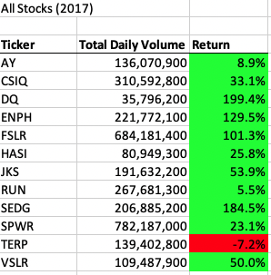
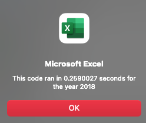
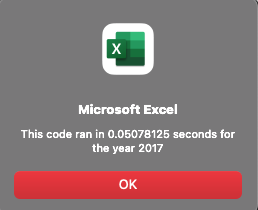
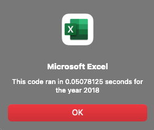
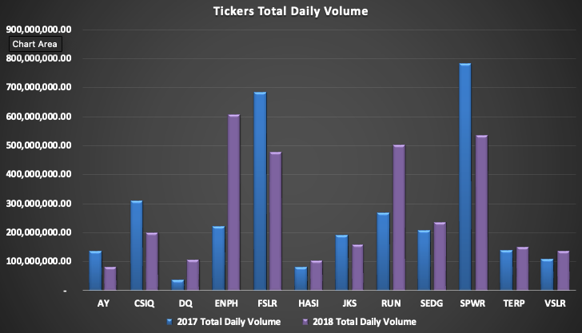
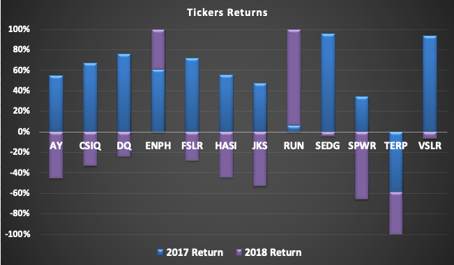

# Stock-Analysis
# Green Stock Analysis (VBA_Challenge)
Tyrone Fraley 
UC Berkley Extension 
September 7, 2022 

## Project Overview
Steve, a good friend of mine recently graduated with his finance degree. He thought what better way to use his newly developed knowledge than to help his parents with the stock market. In an effort to do so, Steve reached out to me to ask for a favor. Being a supporter of green energy Steve wanted to help his parents invest their money into DAQO New energy Coprotation. DAQO makes silicon wafers which are parts for solar panels. In addition, Steve would like to assist his parents with diversifying their funds. This would entail investing their hard earned money into other green energy stocks as well. This is where the favor he asked of me comes in! Steve wanted me to go through an excel file he gave to me to analyze stock data.

## Purpose
To meet the purpose of this project it was important for me to analyze the stock data I used VBA (Visual Basic for Applications) as my primary tool in excel. VBA allowed me to automate tasks, create buttons that could run an analysis or clear worksheet data, utilize for loops to analyze, calculate, and load data quickly into several worksheets, utilize the yearValue = InputBox code to introduce years within the worksheets, facilitate conditional formating, and finally populate data load times with the help of the endTime = Timer and MsgBox codes. To organize the data within the worksheets to make the data comprehensible. Three key titles were added to the data: tickers (stock name), Total Daily Volume (total stocks value), and Return (performance of stocks). Within the for loop a nested for loop was utilized to analyze total volume, starting price, and ending price of stocks. Later in this report macro scripts will be shown to allow better understanding of how the data was extracted through the help of VBA.In addition to adding worksheets "DQ Analysis" to analyze the DQ total daily volume and returns. Another sheet was added called "All Stocks Analysis." by the request of Steve. This worksheet allowed for all stocks to be observed by utilizing VBA to create buttons that would clear the worksheet and analyze the stock data. A yearValue and InputBox macro was placed within the "All Stocks Analysis" macro to allow for Steve to analyze 2017 or 2018 data. Conditional formating on stocks (green for positive returns and red for negative returns) was added to increase the user's experience.

## Results

When analyzing the stock data between 2017 and 2018. Considering the average return in 2017 was 67.3% amongst all stock data for 2017 and -8.5% in 2018. The strongest stocks between 2017 and 2018 were ENPH and RUN. ENPH had returns 129.5% in 2017 and 81.9% in 2018. RUN had returns of 5.5% in 2017 84% for 2018. Knowing this, one could deduce that ENPH had dropped nearly 37% in returns from 2017 to 2018. Which could make RUN a better stock option considering the  1,427.27% increase on returns. The original stock that Steve was interested in (DQ) had significant diminishes on returns. With a final 2017 return at 199.4% and final 2018 return at -62.6%. The returns for DQ dropped 68.60%.

### 2017 and 2018 Stock Data

##Refactored Code

Sub AllStocksAnalysisRefactored()
    Dim startTime As Single
    Dim endTime  As Single

    Worksheets("All Stocks Analysis").Activate

    yearValue = InputBox("What year would you like to run the analysis on?")

    startTime = Timer
    
    'Format the output sheet on All Stocks Analysis worksheet
    
    
    Range("A1").Value = "All Stocks (" + yearValue + ")"
    
    'Create a header row
    Cells(3, 1).Value = "Ticker"
    Cells(3, 2).Value = "Total Daily Volume"
    Cells(3, 3).Value = "Return"

    'Initialize array of all tickers
    Dim tickers(12) As String
    
    tickers(0) = "AY"
    tickers(1) = "CSIQ"
    tickers(2) = "DQ"
    tickers(3) = "ENPH"
    tickers(4) = "FSLR"
    tickers(5) = "HASI"
    tickers(6) = "JKS"
    tickers(7) = "RUN"
    tickers(8) = "SEDG"
    tickers(9) = "SPWR"
    tickers(10) = "TERP"
    tickers(11) = "VSLR"
    
    'Activate data worksheet
    Worksheets(yearValue).Activate
    
    'Get the number of rows to loop over
    RowCount = Cells(Rows.Count, "A").End(xlUp).Row
    
    '1a) Create a ticker Index
    Dim tickerIndex As Integer
    tickerIndex = 0

    '1b) Create three output arrays
    Dim tickerVolumes(12) As Long
    Dim tickerStartingPrices(12) As Single
    Dim tickerEndingPrices(12) As Single
    
    ''2a) Create a for loop to initialize the tickerVolumes to zero.
    
    For i = 0 To 11
    
        tickerVolumes(i) = 0
        
    Next i
        
        ''2b) Loop over all the rows in the spreadsheet.
        For i = 2 To RowCount
            If Cells(i, 1).Value = tickers(tickerIndex) Then
    
           '3a) Increase volume for current ticker
             tickerVolumes(tickerIndex) = tickerVolumes(tickerIndex) + Cells(i, 8).Value
            
            End If
        
        
            '3b) Check if the current row is the first row with the selected tickerIndex. 'If Then
             
            If Cells(i - 1, 1).Value <> tickers(tickerIndex) And Cells(i, 1).Value = tickers(tickerIndex) Then

                tickerStartingPrices(tickerIndex) = Cells(i, 6).Value
            
            End If
        
        '3c) check if the current row is the last row with the selected ticker
         'If the next row’s ticker doesn’t match, increase the tickerIndexIf Then.
        
            If Cells(i + 1, 1).Value <> tickers(tickerIndex) And Cells(i, 1).Value = tickers(tickerIndex) Then

                tickerEndingPrices(tickerIndex) = Cells(i, 6).Value

            '3d Increase the tickerIndex. If Then
      
                tickerIndex = tickerIndex + 1
            
            End If
    
    Next i
    
    
    '4) Loop through your arrays to output the Ticker, Total Daily Volume, and Return.
    For i = 0 To 11
        
        Worksheets("All Stocks Analysis").Activate
        
        Cells(4 + i, 1).Value = tickers(i)
        Cells(4 + i, 2).Value = tickerVolumes(i)
        Cells(4 + i, 3).Value = tickerEndingPrices(i) / tickerStartingPrices(i) - 1
        
           
        
        Next i
    
    'Formatting
    Worksheets("All Stocks Analysis").Activate
    Range("A3:C3").Font.FontStyle = "Bold"
    Range("A3:C3").Borders(xlEdgeBottom).LineStyle = xlContinuous
    Range("B4:B15").NumberFormat = "#,##0"
    Range("C4:C15").NumberFormat = "0.0%"
    Columns("B").AutoFit

    dataRowStart = 4
    dataRowEnd = 15

    For i = dataRowStart To dataRowEnd
        
        If Cells(i, 3) > 0 Then
            
            Cells(i, 3).Interior.Color = vbGreen
            
        Else
        
            Cells(i, 3).Interior.Color = vbRed
            
        End If
        
    Next i
 
    endTime = Timer
    MsgBox "This code ran in " & (endTime - startTime) & " seconds for the year " & (yearValue)

End Sub

##Summary

Refactoring the code did take some time; however, it did assist in creating more efficient parameters around my code. Code refactoring not only allows for the user to run the code at a faster rate (see below time results). As Ershad (2017) notes, code refactoring allows easy maintenance of code and it removes bad code smell which reduces the chances of having future defects wihtin the code. Knowing this could influence one to practice code refactoring regulary. Especially when according to Fowler (N.D.), "refactoring lowers cost of enhancements." Such enhancements; albeit, sometimes time consuming seem like a best practice approach in ones repertoire. However, the cons could emit themselves considering the process to refactor code can be time consuming. In addition, Ershad (2017) offers a counter argument to Fowler. Ershad (2017), code refactoring offers several dangers such as being an expensive and risky initiative in the opinions of some managers, could allow bugs, limited time on delivery, and some managers may not concern themselves with maintainability nor the extension of the code base.  

As mentioned before, the refactored code offered quicker run times than the previous code (unrefactored) wihtin the VBA script. The refactored code did have the disadvantage of being more time consuming. However, this could be based on how new I was to code refactoring when coding and analyzing the Green Stocks data set. The original script had macro run times at 0.26 (2017 data) and 0.25 (2018 data). Once the macro was refactored the run times became 0.05 for 2017 and 2018 as well. All of which can be viewed below.  
 
 ### Non Refactored Macro
 

## Refactored Macro

### Ticket Retuns and Total Volumes Results in Graphical View

### References

Ershad, G. M. (2017, Jan 09). Pros and Cons of Code Refactoring. C-sharpcorner.com. https://www.c-sharpcorner.com/article/pros-and-cons-of-code-refactoring/
Fowler, M. (N.D.). Refactoring. Refactoring.com. Refactoring.com
